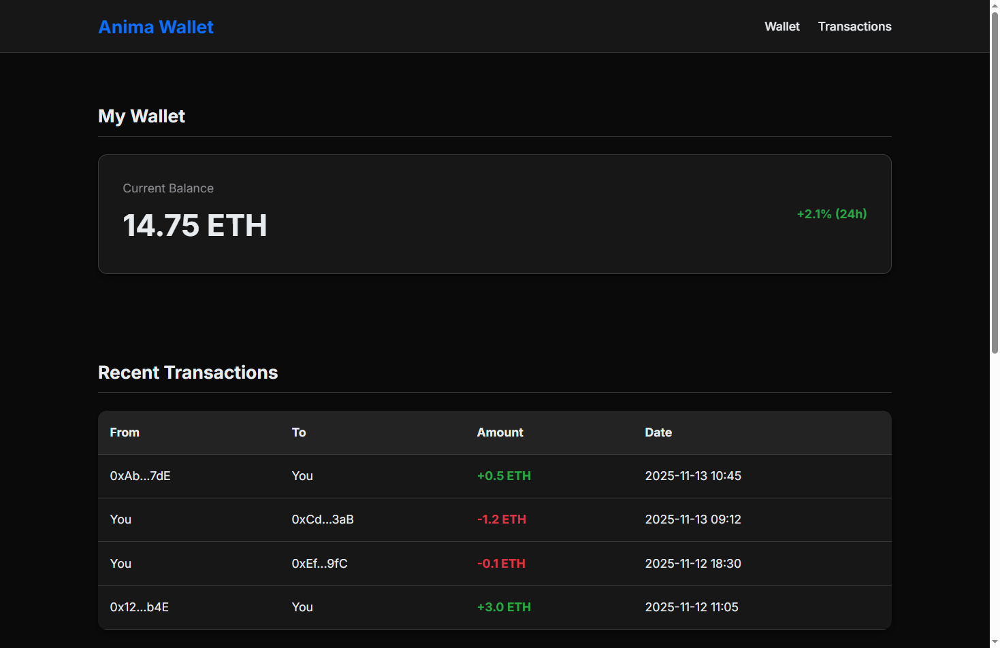
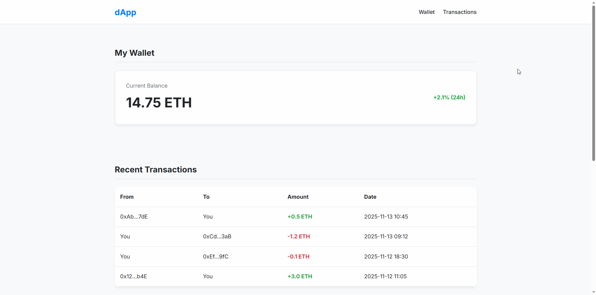
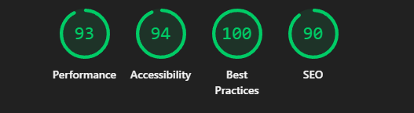
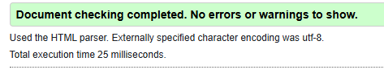

# Anima Wallet - dApp Dashboard

Detta projekt är en inlämningsuppgift i kursen HTML & CSS. Målet var att bygga ett responsivt, visuellt gränssnitt för en fiktiv decentraliserad applikation (dApp). Fokus ligger på modern HTML5 och CSS3, inklusive responsiv design, CSS-variabler och stöd för ljust/mörkt läge.

**Live Demo:** [https://animaforge.github.io/anima-wallet/](https://animaforge.github.io/anima-wallet/)

## Förhandsvisning

### Mörkt Läge

### Ljust Läge

## Teknisk Implementation

*   **Semantisk HTML5:** Strukturen är uppbyggd med semantiska element som `<header>`, `<main>`, `<section>` och `<footer>` för att säkerställa en tillgänglig och SEO vänlig grund.

*   **Modern CSS:**
    *   **CSS Variabler:** Alla färger hanteras centralt med CSS-variabler för att enkelt kunna hantera teman.
    *   **Dark Mode by Default:** Projektet använder mörkt läge som standard och växlar till ljust läge med hjälp av media queryn `@media (prefers-color-scheme: light)`.
    *   **Flexbox:** Används för att skapa flexibla och responsiva layouter i komponenter som header och kort.
    *   **Responsiv Design:** Media queries används för att anpassa layouten för olika skärmstorlekar, från mobil till stora desktops.
*   **Tillgänglighet (a11y):** Stor vikt har lagts vid tillgänglighet, med tydlig fokus-styling för tangentbordsnavigation, korrekta `label`-kopplingar i formulär och en logisk rubrikstruktur.

## Tillgänglighetsgranskning

Resultaten från Lighthouse visar på en hög nivå av tillgänglighet och kodkvalitet.

*HTML-koden validerades utan fel via W3C Validator.*

